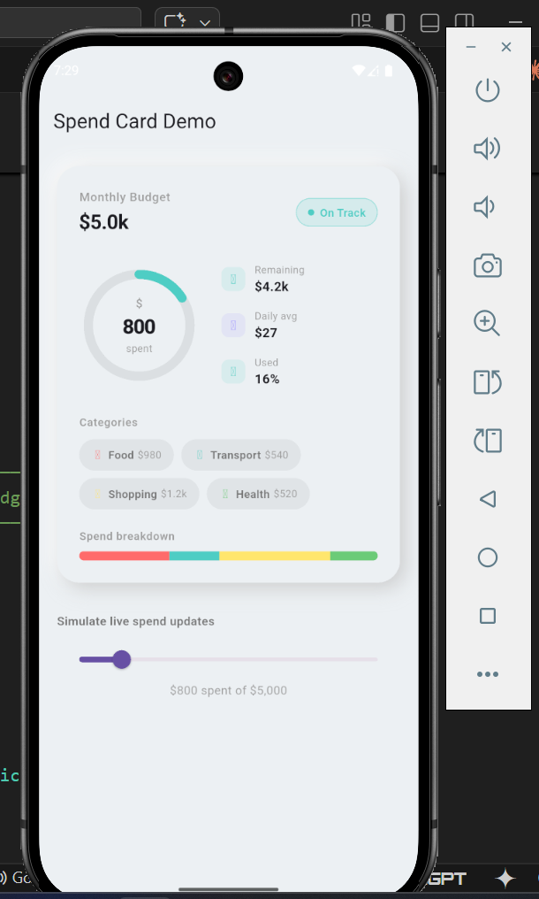
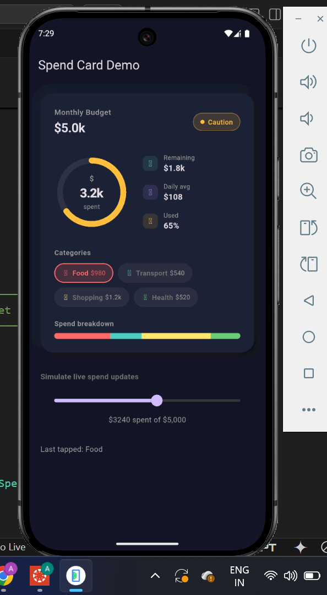

# neomorphic_spend_card

[](https://pub.dev/packages/neomorphic_spend_card)
[](https://opensource.org/licenses/MIT)
[](https://flutter.dev)

A beautiful, animated **neumorphic spend overview card** for Flutter fintech apps.

---

## Preview

| Light mode | Dark mode |
|---|---|
|  |  |

---

## Features

- 🎯 **Animated arc ring** — budget utilisation sweeps from 0 → target with a glowing tip dot
- 🔢 **Count-up ticker** — spend amount animates from zero on mount and on every update
- 📊 **Stat rows** — remaining budget, daily average, and % used
- 🏷️ **Category chips** — tap to select, animated highlight, optional icons
- 📉 **Stacked progress bar** — colour-coded breakdown of every category
- ✨ **Pulse animation** — micro-scale pulse fires on mount and on value change
- 🌗 **Dark / light neumorphic shadows** — dual-shadow depth system adapts automatically
- ♻️ **Reusable sub-widgets** — `ArcPainter`, `NeomorphicContainer`, and `SpendCategory` are all exported for use in your own widgets

---

## Getting started

Add to your `pubspec.yaml`:

```yaml
dependencies:
  neomorphic_spend_card: ^1.0.0
```

Then run:

```sh
flutter pub get
```

---

## Usage

### Minimal

```dart
import 'package:neomorphic_spend_card/neomorphic_spend_card.dart';

NeomorphicSpendCard(
  totalBudget: 5000,
  amountSpent: 3240,
  currency: '\$',
  categories: [
    SpendCategory(label: 'Food',      amount: 980,  color: Color(0xFFFF6B6B)),
    SpendCategory(label: 'Transport', amount: 540,  color: Color(0xFF4ECDC4)),
    SpendCategory(label: 'Shopping',  amount: 1200, color: Color(0xFFFFE66D)),
    SpendCategory(label: 'Health',    amount: 520,  color: Color(0xFF6BCB77)),
  ],
)
```

### With all options

```dart
NeomorphicSpendCard(
  totalBudget: 5000,
  amountSpent: _spent,
  currency: '€',
  categories: _categories,

  // Optional
  cardColor: const Color(0xFFECF0F3), // match your scaffold bg
  animationDuration: const Duration(milliseconds: 1200),
  showPulseOnMount: true,
  showIcons: true,           // show IconData inside chips
  hapticFeedback: true,      // light impact on chip tap
  onCategoryTap: (index) {
    // index == -1 means selection was cleared
    print('Tapped category $index');
  },
)
```

### Live spend updates

Simply call `setState` with a new `amountSpent` value. The card detects the
change via `didUpdateWidget` and re-runs all animations automatically:

```dart
FloatingActionButton(
  onPressed: () => setState(() => _spent += 100),
  child: const Icon(Icons.add),
)
```

### Using sub-widgets independently

```dart
// Standalone arc ring
CustomPaint(
  painter: ArcPainter(
    progress: 0.72,
    arcColor: Colors.teal,
    trackColor: Colors.grey.shade200,
    strokeWidth: 12,
  ),
  size: const Size(160, 160),
)

// Neumorphic container
NeomorphicContainer(
  color: const Color(0xFFECF0F3),
  isDark: false,
  borderRadius: 20,
  shadowIntensity: 1.2,
  child: Padding(
    padding: const EdgeInsets.all(20),
    child: Text('Any content here'),
  ),
)
```

---

## API reference

### `NeomorphicSpendCard`

| Property | Type | Default | Description |
|---|---|---|---|
| `totalBudget` | `double` | — | Budget ceiling. Must be > 0. |
| `amountSpent` | `double` | — | Amount spent. Animates on change. |
| `categories` | `List<SpendCategory>` | — | At least 1 required. |
| `currency` | `String` | `'\$'` | Symbol prepended to amounts. |
| `cardColor` | `Color?` | auto | Card surface colour. Match scaffold bg. |
| `animationDuration` | `Duration` | `1400ms` | Arc + ticker animation speed. |
| `showPulseOnMount` | `bool` | `true` | Pulse animation on first render. |
| `showIcons` | `bool` | `false` | Show `icon` inside category chips. |
| `hapticFeedback` | `bool` | `true` | Light haptic on chip tap. |
| `onCategoryTap` | `ValueChanged<int>?` | `null` | Fires with index (or -1 if cleared). |

### `SpendCategory`

| Property | Type | Description |
|---|---|---|
| `label` | `String` | Chip label text. |
| `amount` | `double` | Spend in this category. |
| `color` | `Color` | Dot, chip border, and bar segment colour. |
| `icon` | `IconData?` | Optional chip icon (needs `showIcons: true`). |

### `ArcPainter`

| Property | Type | Default | Description |
|---|---|---|---|
| `progress` | `double` | — | 0.0 – 1.0 sweep fraction. |
| `arcColor` | `Color` | — | Arc stroke colour. |
| `trackColor` | `Color` | — | Background circle colour. |
| `strokeWidth` | `double` | `10.0` | Thickness of arc and track. |

### `NeomorphicContainer`

| Property | Type | Default | Description |
|---|---|---|---|
| `color` | `Color` | — | Surface background colour. |
| `isDark` | `bool` | — | Switches shadow set. |
| `borderRadius` | `double` | `24` | Corner radius. |
| `shadowIntensity` | `double` | `1.0` | Shadow opacity multiplier. |

---

## Theming tip

The neumorphic depth effect only works when `cardColor` matches your scaffold
background exactly. Use the same color for both:

```dart
const surfaceColor = Color(0xFFECF0F3);

Scaffold(
  backgroundColor: surfaceColor,
  body: NeomorphicSpendCard(
    cardColor: surfaceColor,
    // ...
  ),
)
```

---

## Running the example

```sh
cd example
flutter run
```

Use the slider at the bottom of the demo screen to simulate live spend updates
and watch all animations replay automatically.

---

## Running tests

```sh
flutter test
```

---

## Contributing

Contributions, issues, and feature requests are welcome!
Please open an issue first to discuss what you would like to change.

1. Fork the repo
2. Create a branch: `git checkout -b feat/my-feature`
3. Commit: `git commit -m 'feat: add my feature'`
4. Push: `git push origin feat/my-feature`
5. Open a Pull Request

---

## License

MIT © 2026 Your Name. See [LICENSE](LICENSE) for details.
